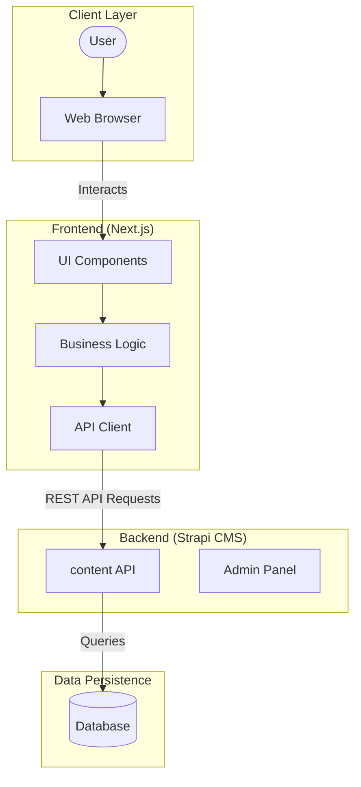

# 🚀 Zenith Space Tourism

**Zenith Space Tourism** is a futuristic, luxury space travel booking platform. It provides an immersive experience for users to browse and book interplanetary expeditions, orbital hotels, and lunar bases.

This repository is a monorepo containing both the **Headless CMS Backend** and the **Next.js Frontend**.

## 🏗️ Architecture

The application follows a modern decoupled architecture:



- **Frontend**: Built with **Next.js 14** (App Router), **Tailwind CSS** for styling, and **Framer Motion** for animations. It fetches content dynamically from the backend.
- **Backend**: Powered by **Strapi v5**, a flexible Headless CMS. It manages content (Destinations, Bookings) and serves it via a REST API.
- **Database**: Uses SQLite for local development and PostgreSQL for production (configured via Render).

---

## 📂 Project Structure

```bash
zenith-space-app/
├── backend/            # Strapi Headless CMS application
│   ├── src/            # Content Types and API logic
│   └── ...
├── frontend/           # Next.js Web Application
│   ├── src/
│   │   ├── app/        # Next.js App Router Pages
│   │   ├── components/ # React UI Components
│   │   └── lib/        # API Utilities
│   └── ...
├── render.yaml         # Infrastructure as Code for Render.com deployment
└── package.json        # Root script management
```

---

## 🛠️ Prerequisites

- **Node.js** (v18 or higher recommended)
- **npm** (v9 or higher)
- **Git**

---

## 🚀 Getting Started

Follow these steps to set up the project locally.

### 1. Clone the Repository

```bash
git clone https://github.com/your-username/zenith-space-app.git
cd zenith-space-app
```

### 2. Backend Setup (Strapi)

Initialize and start the CMS first to serve content.

```bash
cd backend
npm install
npm run develop
```
- The Admin Panel will be available at: `http://localhost:1337/admin`
- The API will be available at: `http://localhost:1337/api`

> **Note:** If setting up for the first time, create an admin user when prompted.

### 3. Frontend Setup (Next.js)

Open a new terminal window to run the frontend.

```bash
cd frontend
npm install
```

**Configure Environment Variables:**

Create a `.env.local` file in the `frontend/` directory:

```bash
# frontend/.env.local
NEXT_PUBLIC_STRAPI_API_URL=http://localhost:1337
# Or for production: https://your-render-url.onrender.com
```

**Start the Development Server:**

```bash
npm run dev
```
- The application will be available at: `http://localhost:3000`

---

## 📦 Deployment

This project is configured for easy deployment on **Render.com** using Infrastructure as Code (IaC).

1. **Push** your code to a GitHub repository.
2. **Connect** your repo to Render.
3. Render will detect the `render.yaml` file and automatically provision:
   - A **PostgreSQL Database**.
   - A **Web Service** for Strapi (`backend`).
   - (Optional) You can deploy the `frontend` as a Static Site or Web Service on Vercel or Render.

**Important:** For the frontend to connect to the deployed backend, ensure you update the `NEXT_PUBLIC_STRAPI_API_URL` environment variable in your frontend deployment settings.

---

## 🎨 Features & Technologies

- **Space-Themed UI**: Custom Tailwind configuration for deep space aesthetics.
- **Responsive Design**: Mobile-first approach using Flexbox and Grid.
- **Animations**: Smooth transitions using `framer-motion`.
- **Dynamic Content**: All destinations are managed via the Strapi Admin panel.
- **Monorepo**: Unified codebase for easier management.

---

## 📝 License

This project is licensed under the MIT License.
